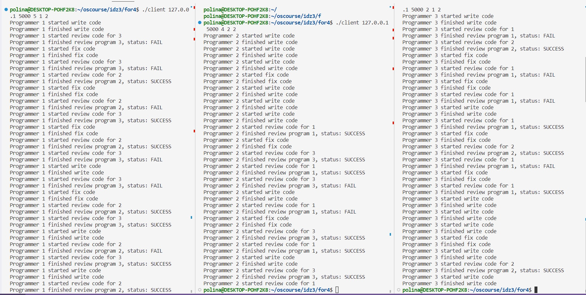

# Индивидуальное домашнее задание №3, Вариант 21
## **Исполнитель**: Копырина Полина Ивановна, группа БПИ213

## **Условие задачи**: Задача о программистах.
В отделе работают три программиста. Каждый программист пишет свою программу и отдает ее на проверку другому случайному программисту. 
Программист переключается на проверку чужой программы, когда его собственная уже написана и передана на проверку. По завершении проверки,
программист возвращает программу с результатом (формируемым случайно по любому из выбранных Вами законов): программа написана правильно или 
неправильно. Программист спит, если отправил свою программу и не проверяет чужую программу. Программист просыпается, когда получает 
заключение от другого программиста. Если программа признана правильной, программист пишет другую программу, если программа признана неправильной, 
программист исправляет ее и отправляет на проверку тому же программисту, который ее проверял. К исправлению своей программы он приступает, 
завершив проверку чужой программы. Проверки и коррекции одной программы могут проходить многократно (правильность программы задается случайным 
образом). При наличии в очереди проверяемых программ и приходе заключения о неправильной своей программы программист может выбирать любую
из возможных работ. Создать приложение, моделирующее работу программистов. Каждый программист — отдельный клиент. Сервер обеспечивает передачу
 данных между клиентами.

## Решение на 4-5
В решении используются дв основные сущности - сервер (server.c) и клиент (client.c). Сущность клиента - это программист из задачи. Так как поведение программистов идентично, то нет необходимости создавать отдельные файлы с кодом для каждого из 3 программистов, достаточно запустить программу client.c три раза в разных процессах.

Чтобы скомпилировать вышеупомянутые файлы, необходимо ввести команды вида:
```
gcc server.c -o server -pthread
gcc client.c -o client
```
Сервер инициализируется портом, к которому будет привязан сокет, например:
```
./server 5000
```
При запуске клиент инициализируется 5 аргументами командной строки:
* IP адрес сервера
* Порт сервера
* Время на написание кода
* Время на ревью
* Время на правку кода

Последние три аргумента - кастомизация работы программиста, столько секунд займет имитация деятельности определенного вида (причем для привнесения элемента случайности время работы рандомно может уменьшиться/увеличиться на 1).

Пример запуска:
```
./client 127.0.0.1 5000 5 2 3
```

Сервер общается с каждым из трех клиентов-программистов в отдельном потоке. Клиенты и сервер
обмениваются информацией с помощью структуры данных EventMessage, которая содержит id и обновленный статус программы.

Клиент отправляет серверу сообщение каждый раз, как начинает или заканчивает делать какое-то действие. Сообщения от 
сервера к клиенту это скорее "указание к действию", сервер выдает информацию о задаче, над которой программист-клиент 
сейчас будет работать. В логах/истории будут отображаться только сообщения, созданные клиентами (так как сообщения от 
сервера просто дублируют уведомления от клиентов).

Когда клиент соединяется с сервером, сервер отправляет сообщение с id программы и статусом "IN_PROCESS" - это стартовое сообщение, по которому клиент узнает свой порядковый id и начинает работать над первой программой (id программы соответствует id программиста, id присваивается в порядке подключения клиента к серверу от 1 до 3).

Как только клиент-программист закончил делать какое-то действие, от ждет 
сообщение от сервера. Сервер же, получив сообщение о законченном задании от 
программиста, проходит по статусам всех трех программ и смотрит, может ли 
программист взять задачу в работу. Ревью и исправление багов имеет больший 
приоритет, чем написание новой программы.

Для синхронизации потоков используются семафоры - для каждого клиента сервер создает свой собственный семафор, значение которого соответсвует количеству задач, которые еще не взяты в работы и ждут своей очереди. Как только клиент завершил какое-то действие и оповестил об этом сервер, сервер ждет, пока семафор данного клиента станет положительным (= появилась задача), и отправляет клиенту сообщение об этой задаче.

Каждый клиент логирует свои действия в терминале, так что на данном этапе отследить историю можно только в терминалах клиентов-программистов.
(скриншот работы можно посмотреть в for4-5/test.jpg).


И клиент, и сервер реагируют на прерывание посредством ^C и обрабатывают этот сигнал, закрывая сокеты (и семафоры, если таковые имеются).

## Решение на 6-7
Была добавлена новая сущность visitor.c, которая представляет собой модифицированный клиент.
Компиляция:
```
gcc visitor.c -o visitor
```
В качестве аргументов командной строки принимает ip адресс сервера и порт.
```
./visitor 127.0.0.1 5001
```

Сервер ожидает подключение визитора после! подключения всех 
основных клиентов-программистов. Общение с этим клиентом 
происходит в основном потоке, в отличие от клиентов-программистов.

Как только сервер получает сообщение от клиента-программиста, он 
преобразует это сообщение в строку, сохраняет в буфер и 
отправляет клиенту-наблюдателю.

Для синхронизации вывода сообщений было создано два семафора - семафор для доступа к записи в буфер (для преобразования сообщения в строку) и семафор для чтения из буфера (при передаче содержимого буфера по сети, чтобы содержимое не изменилось). Причем поток не сможет записать что-то в буфер, пока содержимое буфера не передалось клиенту-наблюдателю.

Клиент-наблюдатель также реагирует на ^C закрытием сокета (но это поломает работу сервера из-за вышеупомянутой синхронизации, поэтому советуется завершать работу наблюдателя после завершения работы остальных клиентов.)

Пример логов программы приведет в файле for6-7/result.txt (там находятся скопмированные логи из консоли).